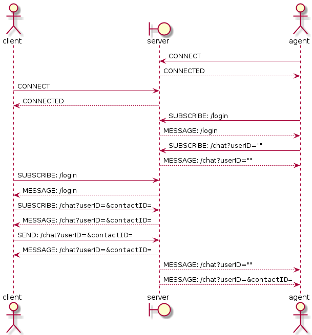

# GO:Chat - Realtime Chat Service
GO:Chat was build to help customer service and user easy to communicate.

## Overview
This project was inspired by java spring boot websocket, that enable Simple Broker Message, using Stomp. So, i challenge my self to build it with golang. It still need some improvement, but this beast is ready to run in production mode.

## How things work


## Tech used
1. Golang
2. Redis
3. Websocket
4. Stomp

## Installation
1. Install dependencies
```
> go mod download
```

2. Run it
```
> go run app/main.go
``` 